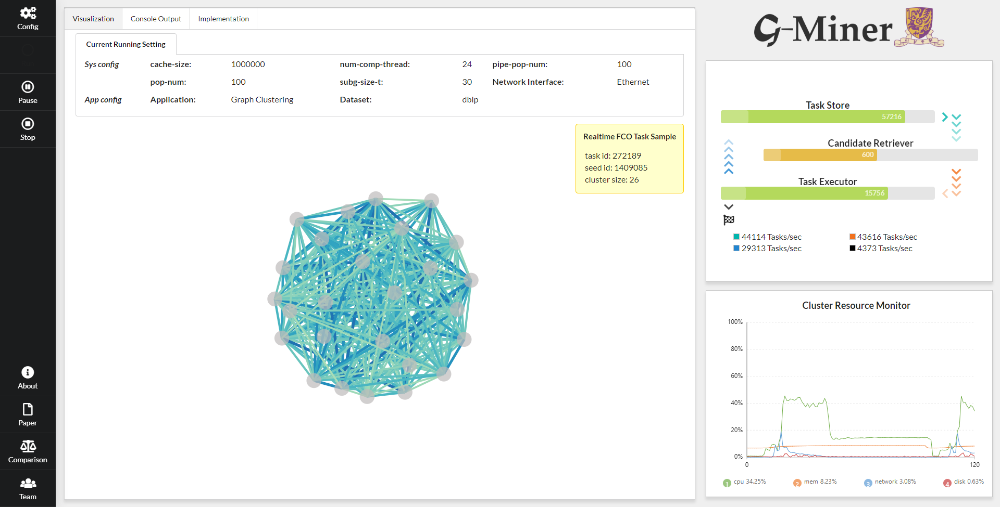

# G-Miner

G-Miner is a general distributed system aimed at graph mining over large-scale graphs.

Graph mining is one of the most important areas in data mining. However, scalable solutions for graph mining are still lacking as existing studies focus on sequential algorithms. While many distributed graph processing systems have been proposed in recent years, most of them were designed to parallelize computations such as PageRank and Breadth-First Search that keep states on individual vertices and propagate updates along edges. Graph mining, on the other hand, may generate many subgraphs whose number can far exceed the number of vertices. This inevitably leads to much higher computational and space complexity rendering existing graph systems inefficient. We propose G-Miner, a distributed system with a new architecture designed for general graph mining. G-Miner adopts a unified programming framework for implementing a wide range of graph mining algorithms. We model subgraph processing as independent tasks, and design a novel task pipeline to streamline task processing for better CPU, network and I/O utilization.


## Feature Highlights

- **General Graph Mining Schema:** G-Miner aims to provide a unified programming framework for implementing distributed algorithms for a wide range of graph mining applications. To design this framework, we have summarized common patterns of existing graphmining algorithms.

- **Task Model:** G-Miner supports asynchronous execution of various types of operations (i.e., CPU, network, disk) and efficient load balancing by modeling a graph mining job as a set of independent tasks. A task consists of three fields: sub-graph, candidates and context.

- **Task-Pipeline:** G-Miner provides the task-pipeline, which is designed to asyn-chronously process the following three major operations in G-Miner: (1) CPU computation to process the update operation on each task, (2) network communication to pull candidates from remote machines, and (3) disk writes/reads to buffer intermediate tasks on local disk of every machine.


## Getting Started

* **Dependencies Install**

To install G-Miner's dependencies (G++, MPI, JDK, HDFS), please follow the instructions in our project [webpage](http://www.cse.cuhk.edu.hk/systems/gminer/deploy.html).

* **Build**

Please manually MODIFY the dependency path for MPI and HDFS in CMakeLists.txt in root directory.

```bash
$ export GMINER_HOME=/path/to/gminer_root  # must configure this ENV
$ cd $GMINER_HOME
$ ./auto-build.sh
```

* [**Tutorials**](docs/TUTORIALS.md)
### Web Demo
#### prerequisites
  * python 3.6
  * flask 0.12.2 : `$> pip install flask==0.12.2`
  * all G-Miner dependencies described above
#### Start and stop web server
  We suppose you have built and run G-Miner successfully now ( if not, please refer to **Build** and **Tutorial** previous to this step). Then just run following commands :
  ```bash
  $> cd $GMINER_HOME
  $> ./script/start_demo_monitor.sh
  $> ./script/start_demo_server.sh
    * Serving Flask app "main"
    * Running on http://127.0.0.1:2333/ (Press CTRL+C to quit)
  $> ./script/stop_demo_monitor.sh
  ```

  You can configure the server by editing environment variables given in scripts.

  

  Notice that for demo purpose, datasets and their HDFS path has been hard-coded. If you want to deploy the demo server, you can edit them on your demand.

## Academic Paper

[**Eurosys 2018**] [G-Miner: An Efficient Task-Oriented Graph Mining System](docs/G-Miner-Eurosys18.pdf). Hongzhi Chen, Miao Liu, Yunjian Zhao, Xiao Yan, Da Yan, James Cheng.

## Acknowledgement
The subgraph-centric vertex-pulling API is attributed to our prior work [G-thinker](https://arxiv.org/abs/1709.03110).

## License

Copyright 2018 Husky Data Lab, CUHK
